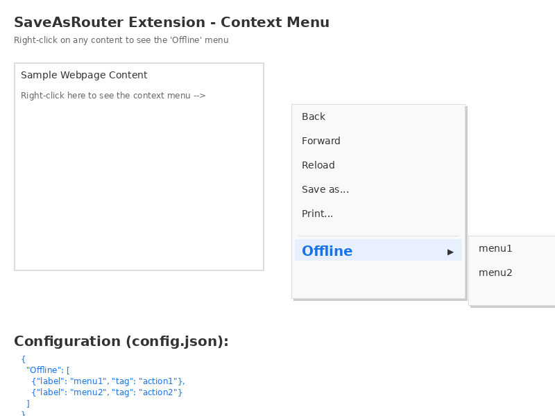

# SaveAsRouter - Quick Start Guide

Get started with SaveAsRouter in 3 minutes!

## Installation (2 minutes)

1. **Open Chrome Extensions page**
   - Type `chrome://extensions/` in your address bar and press Enter
   - Or: Click ⋮ (menu) → More Tools → Extensions

2. **Enable Developer Mode**
   - Toggle the "Developer mode" switch in the top-right corner

3. **Load the Extension**
   - Click "Load unpacked" button
   - Navigate to and select the `SaveAsRouter` folder
   - The extension will appear with a blue "O" icon

## First Test (1 minute)

1. **Open the test page**
   - Open `test.html` from the SaveAsRouter folder
   - Or navigate to any website (e.g., https://www.google.com)

2. **Right-click anywhere**
   - Right-click on text, images, or links
   - Look for "Offline" in the context menu
   - Hover over it to see the sub-menu

3. **Click a menu item**
   - Click "menu1" → Alert shows: `action1`
   - Click "menu2" → Alert shows: `action2`

## That's it! 🎉

Your extension is now working! The "Offline" menu will appear whenever you right-click on any webpage.

## Next Steps

### Customize Menu Items

Edit `config.json`:
```json
{
  "Offline": [
    {
      "label": "Your Label Here",
      "tag": "your_tag"
    }
  ]
}
```

After editing:
1. Go to `chrome://extensions/`
2. Click the refresh icon on SaveAsRouter
3. Your changes are live!

### Customize Actions

Edit the `perform_action` function in `background.js`:
```javascript
function perform_action(tag) {
  // Your custom code here
  console.log('Action triggered:', tag);
  alert(tag);
}
```

## Troubleshooting

**Menu not showing?**
- Reload the extension at `chrome://extensions/`
- Check that the extension is enabled

**Need more help?**
- See [INSTALLATION_GUIDE.md](INSTALLATION_GUIDE.md) for detailed instructions
- See [README.md](README.md) for full documentation
- See [ARCHITECTURE.md](ARCHITECTURE.md) for technical details

## Visual Guide



The image shows:
- The "Offline" menu item in the context menu (highlighted in blue)
- The sub-menu with "menu1" and "menu2"
- What happens when you click each item

## Configuration Examples

### Example 1: Simple Actions
```json
{
  "Offline": [
    {"label": "Save for Later", "tag": "save"},
    {"label": "Archive", "tag": "archive"}
  ]
}
```

### Example 2: Multiple Options
```json
{
  "Offline": [
    {"label": "Read Later", "tag": "read_later"},
    {"label": "Download", "tag": "download"},
    {"label": "Share", "tag": "share"},
    {"label": "Print", "tag": "print"}
  ]
}
```

### Example 3: Categorized
```json
{
  "Offline": [
    {"label": "📁 Save to Folder A", "tag": "folder_a"},
    {"label": "📁 Save to Folder B", "tag": "folder_b"},
    {"label": "📁 Save to Folder C", "tag": "folder_c"},
    {"label": "⬇️  Download Now", "tag": "download"}
  ]
}
```

Note: Emojis work in menu labels! 🎨

## Pro Tips

1. **Use descriptive tags** - They help identify what action was triggered
2. **Keep labels short** - Long labels may be truncated in the menu
3. **Reload after changes** - Always reload the extension after editing files
4. **Check console** - Press F12 and check Console for debug messages
5. **Test thoroughly** - Try right-clicking on different elements (text, images, links)

## Keyboard Shortcuts

Currently, this extension doesn't use keyboard shortcuts, but you can:
- Use Tab to navigate the context menu
- Use arrow keys to navigate sub-menus
- Press Enter to select an item

## Browser Support

✅ **Works on:**
- Google Chrome 88+
- Microsoft Edge 88+
- Brave Browser
- Vivaldi

⚠️ **May need modifications for:**
- Firefox (different manifest format)
- Safari (requires conversion)

## What's Next?

Now that your extension is running, you can:
1. Customize the menu items in `config.json`
2. Modify the `perform_action` function to do more than show alerts
3. Add more sophisticated logic (save to storage, make API calls, etc.)
4. Share your configuration with others!

**Enjoy using SaveAsRouter!** 🚀
